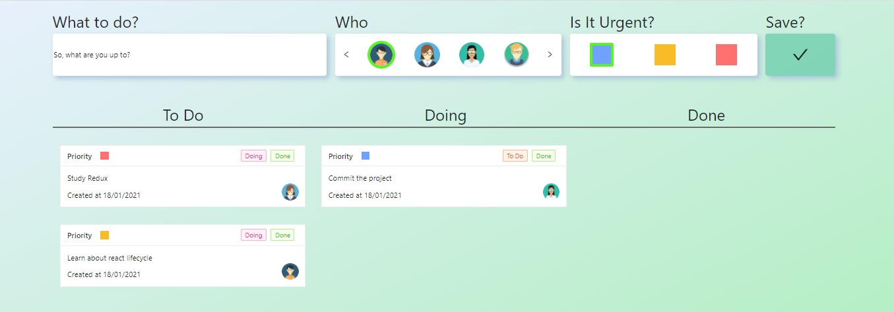

<h1 align="center">
  
</h1>

# Venturus4tech: To-do list
Aplicação desenvolvida durante o Venturus4tech 2021. Trata-se de um to-do list para gerenciamento de tarefas utilizando o conceito de Kanban.

## ⚙️ Tecnologias
- React
- JavaScript
- Ant Design
- Styled-components

## 🤔 Como contribuir

- Faça um fork desse repositório;
- Crie uma branch com as suas alterações: `git checkout -b my-feature`;
- Commit suas alterações: `git commit -m 'feat: my new feature'`;
- Faça um push para a sua branch: `git push origin my-feature`.

## 📜 Licença

> Este projeto está sob a licença MIT. Veja o arquivo [LICENSE](https://github.com/jessicafpx/to-do-list-venturus4tech/blob/main/LICENSE.md) para mais detalhes.

---

##### 
 <strong> <desenvolvido por <a href="github.com/jessicafpx"> @jessicafpx</a> /></strong> 👋
